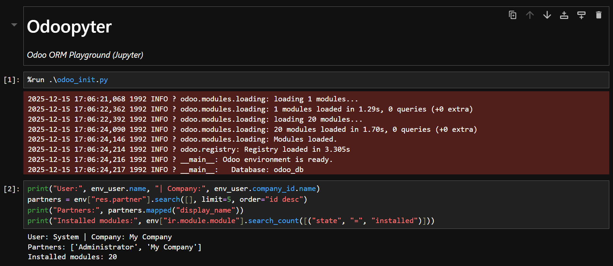

# Odoopyter

`Odoopyter` is a minimal Jupyter notebook for interactive work with the Odoo ORM (via `env`) directly from Python.

## Screenshot



## What this project provides

- Brings up the Odoo Registry and ORM Environment in Jupyter.
- Provides ready-to-use variables:
  - `registry` — model registry
  - `cr` — DB cursor (transaction)
  - `env` — Odoo Environment (ORM)
  - `env_user` — current user (`env.user`)

## Structure

- `Odoo.ipynb` — main notebook.
- `odoo_init.py` — bootstrap script that initializes `registry/cr/env/env_user`.
- `odoo.conf` — example/local copy of the Odoo configuration.

## How it works

1) In `Odoo.ipynb`, the bootstrap script is executed via `%run`.
2) The script:
   - adds the Odoo path to `sys.path`
   - reads the `odoo.conf` configuration
   - creates `registry` and opens `cr`
   - creates `env` and `env_user`
3) After that, you can execute any ORM operations via `env['model']...`.

## Configuration

Connection parameters are defined as constants in `odoo_init.py`:

- `ODOO_PATH` — path to the Odoo directory (where the `odoo` package is located).
- `DB_NAME` — database name.
- `ODOO_CONFIG_PATH` — path to the Odoo configuration.

In the notebook, it is recommended to run the script using a relative path (if `Odoo.ipynb` and `odoo_init.py` are in the same directory):

```python
%run ./odoo_init.py
```

## Database safety

You work directly with a transaction via `cr`.

- `cr.commit()` — persists changes.
- `cr.rollback()` — rolls back changes.

If you are experimenting, it is recommended to use `rollback()` first.

## Demo cell (short)

```python
print("User:", env_user.name, "| Company:", env_user.company_id.name)
partners = env["res.partner"].search([], limit=5, order="id desc")
print("Partners:", partners.mapped("display_name"))
print("Installed modules:", env["ir.module.module"].search_count([("state", "=", "installed")]))
```
